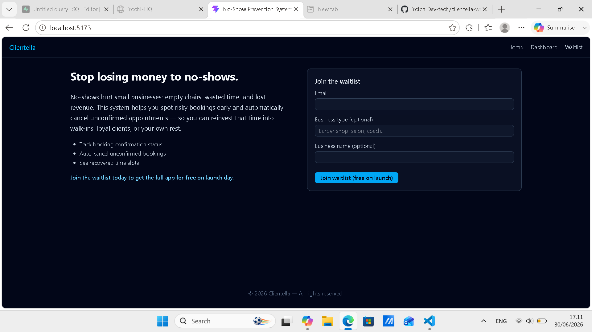

# Clientella - No-Show Prevention System

This is a minimum viable product designed to validate the concept of reducing no-shows for 
small appointment-based businesses such as barbers, salons, coaches, therapists, and similar service providers.

## Screenshot

## Version

This is an MVP version and is intended for validation and early testing. It focuses on essential functionality 
rather than full production features. 
Feedback from testers will guide the development of the complete application.

## Technologies Used

- React + Vite + TypeScript
- TailwindCSS
- Supabase (Postgres, Auth, Realtime)

## Core features

- Create and manage bookings
- Track confirmation status and risk
- Automatically cancel unconfirmed bookings after a deadline
- Show freed time slots and recovered time statistics
- Public landing page with waitlist signup

## Author

Yoichi dev